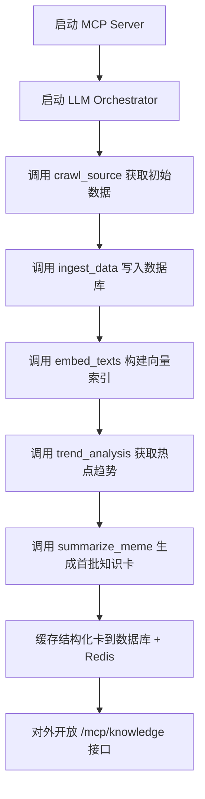

# meme-commons — LLM Orchestrated Meme Intelligence System

> **核心目标：** LLM 作为唯一的智能调度者，所有工具模块仅供内部服务。对外接口（MCP Server）只输出结构化知识卡。系统能自动爬取、解析、总结互联网梗文化信息，生成语义知识库。

---

## 0. 系统架构概览

```
[ User / API Request ]
         │
         ▼
 ┌──────────────────────────┐
 │  MCP Server (Public)     │
 │  expose: /mcp/knowledge  │
 │  返回结构化知识卡         │
 └──────────────────────────┘
         │
         ▼
 ┌──────────────────────────┐
 │   LLM Orchestrator       │
 │  调度智能体执行流程       │
 │  调用内部 Tools：         │
 │    - crawl_source         │
 │    - ingest_data          │
 │    - embed_texts          │
 │    - query_knowledge      │
 │    - summarize_meme       │
 │    - trend_analysis       │
 └──────────────────────────┘
         │
         ▼
 [ Database + Vector Store ]
```

---

## 1. 模块划分

| 模块 | 类型 | 职责 | 是否对外 |
|------|------|------|-----------|
| **MCP Server** | Interface | 提供 `/mcp/knowledge` 接口返回知识卡 | ✅ 是 |
| **LLM Orchestrator** | Core | 调度任务流、调用各内部工具 | ❌ 否 |
| **Crawler Tool** | 内部服务 | 抓取热点内容 | ❌ 否 |
| **Ingest Tool** | 内部服务 | 清洗、存储 | ❌ 否 |
| **Embedding Tool** | 内部服务 | 调用 Dashscope embedding | ❌ 否 |
| **Query Tool** | 内部服务 | 检索 Meme | ❌ 否 |
| **Summarizer Tool** | 内部服务 | 调用 Dashscope LLM 总结 | ❌ 否 |
| **Trend Tool** | 内部服务 | 统计趋势与热度 | ❌ 否 |

---

## 2. 初始化 Workflow（系统自举）



---

## 3. 对外接口（MCP）

### `GET /mcp/knowledge`
返回指定梗的结构化知识卡。

#### 请求参数：
```json
{
  "query": "赤石"
}
```

#### 响应结果：
```json
{
  "title": "赤石",
  "origin": "来自游戏Minecraft的红石机制，后被玩家戏称为‘赤石’",
  "meaning": "表示复杂电路或逻辑装置，也引申为高智商玩家",
  "examples": ["这个赤石电路太强了！"],
  "trend_score": 0.91,
  "last_updated": "2025-11-13"
}
```

---

## 4. 内部工具调用流程（由 LLM 管理）

```python
def orchestrate_knowledge(query):
    memes = call_tool('query_knowledge', {"query": query})

    if not memes:
        new_data = call_tool('crawl_source', {"source": "reddit", "limit": 50})
        call_tool('ingest_data', new_data)
        call_tool('embed_texts', {"texts": [p['content'] for p in new_data]})
        memes = call_tool('query_knowledge', {"query": query})

    summary = call_tool('summarize_meme', {"meme_id": memes[0]['id']})
    call_tool('trend_analysis', {"time_window": "7d"})

    return summary
```

---

## 5. 初始化配置

```bash
DATABASE_URL=postgresql://...
VECTOR_DB_URL=milvus://...
DASHSCOPE_API_KEY=your_key_here
CACHE_URL=redis://...
```

---

## 6. 系统启动顺序

1. 启动数据库与向量库 `docker-compose up -d`
2. 运行 MCP Server：`uvicorn services.api.main:app --port 8000`
3. 初始化 Orchestrator 流程：执行 `python services/orchestrator/init.py`
4. 等待知识卡生成（缓存于 Redis 或数据库）
5. 用户通过 `/mcp/knowledge?query=xxx` 获取结果

---

## 7. 数据表定义

```sql
CREATE TABLE meme_cards (
  id UUID PRIMARY KEY DEFAULT gen_random_uuid(),
  title TEXT,
  origin TEXT,
  meaning TEXT,
  examples TEXT[],
  trend_score FLOAT,
  last_updated TIMESTAMP DEFAULT now()
);

CREATE TABLE posts_raw (
  id UUID PRIMARY KEY DEFAULT gen_random_uuid(),
  platform TEXT,
  url TEXT,
  content TEXT,
  timestamp TIMESTAMP,
  embedding VECTOR(768)
);
```

---

## 8. 核心开发任务

1. **FastAPI MCP Server**：实现 `/mcp/knowledge` 接口。  
2. **LLM Orchestrator**：封装 Dashscope API 与工具调用逻辑。  
3. **Crawler / Ingest / Embedding / Query / Summarizer / Trend Tools**：内部服务。  
4. **init.py**：执行初始化 workflow（自动爬取 + 嵌入 + 知识卡生成）。  
5. **Scheduler**（可选）：周期性触发 trend 更新。

---

## 9. 最终系统输出
- **结构化知识卡库**（JSON + 向量索引）
- **MCP 公共接口** `/mcp/knowledge` — 返回可被 LLM 理解的 meme 信息
- **内部数据流闭环**：自动更新、热度跟踪、梗文化结构化归档

